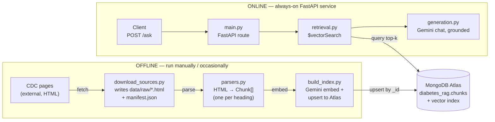
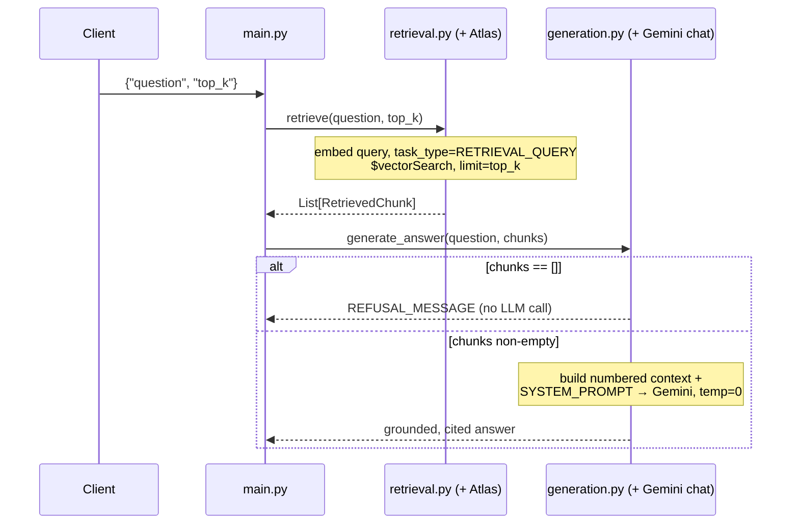

# diabetes-rag-assistant — Architecture Guide

Internal engineering reference. A retrieval-augmented generation service that
answers diabetes questions strictly from a curated, citable source corpus —
and refuses rather than guesses when that corpus doesn't support a confident
answer. This doc walks a new engineer through how it's built, end to end.

`FastAPI` · `MongoDB Atlas Vector Search` · `Gemini embeddings + chat` ·
`v1 scope: CDC only` · `Render`

> Snapshot as of commit `574cc36` (2026-09-15) — not a live document; verify
> specifics against current code before relying on them for anything
> load-bearing.

## Contents

1. [Overview](#1-overview)
2. [Two-phase architecture](#2-two-phase-architecture)
3. [Request lifecycle: `POST /ask`](#3-request-lifecycle-post-ask)
4. [Component reference](#4-component-reference)
5. [Data model & citation contract](#5-data-model--citation-contract)
6. [Grounding rules (the system prompt)](#6-grounding-rules-the-system-prompt)
7. [API reference](#7-api-reference)
8. [Environment & deployment](#8-environment--deployment)
9. [Golden eval set](#9-golden-eval-set)
10. [Known limitations & gotchas](#10-known-limitations--gotchas)
11. [Getting started](#11-getting-started)

---

## 1. Overview

The assistant answers questions about diabetes by retrieving relevant
passages from a knowledge base and having an LLM compose an answer **only**
from those passages, with an inline citation for every claim. If the
retrieved passages don't support a confident answer — or the question asks
for something the system should never answer, like a personal dosing
decision — it refuses instead of guessing.

That refusal-first behavior isn't a guardrail bolted on afterward; it's
encoded directly in `app/generation.py`'s system prompt as five
priority-ordered rules (see [§6](#6-grounding-rules-the-system-prompt)), and
it's the main thing the golden eval set ([§9](#9-golden-eval-set)) checks for.

## 2. Two-phase architecture

The single most important thing to internalize before touching this
codebase: ingestion and serving are two separate, decoupled processes that
only ever meet inside MongoDB Atlas.



The ingestion pipeline (top lane) never runs as part of a deploy or a
request — it's invoked by hand whenever `data/raw/manifest.json` changes.
The FastAPI service (bottom lane) never writes to Atlas, only reads. The two
lanes share no code path; the only thing connecting them is the Atlas
collection itself.

**Why:** Clinical guidelines like the ADA Standards of Care are revised
annually. Re-embedding and re-upserting on every deploy would be wasteful
and could race concurrent deploys — so ingestion is a deliberate, separate
operation you re-run when a source changes, not a build step.

## 3. Request lifecycle: `POST /ask`

What actually happens between a client's question and the JSON response,
including the branch that skips the LLM entirely.



The refusal path when retrieval returns nothing is a local short-circuit in
`generate_answer()` — no Gemini call happens. Every other refusal (off-topic
question, dosing request, etc.) still retrieves `top_k` chunks as normal and
relies on the LLM following the system prompt's rules to decline. See
[§10](#10-known-limitations--gotchas) for why that matters.

## 4. Component reference

Repository layout and what each module actually does, file by file.

```
diabetes-rag-assistant/
├── app/                      # online: the FastAPI service
│   ├── main.py                # routes: GET /health, POST /ask
│   ├── retrieval.py           # embed query + Atlas $vectorSearch
│   └── generation.py          # grounded prompt + Gemini chat call
├── ingestion/                 # offline: builds the knowledge base
│   ├── download_sources.py    # fetch raw docs → data/raw/, update manifest
│   ├── parsers.py             # raw file → structure-aware Chunk[]
│   └── build_index.py         # parse → embed → upsert to Atlas (runnable)
├── data/
│   └── raw/                   # tracked source docs + manifest.json
│       └── cdc/                # diabetes-basics.html, living-with-diabetes.html
├── eval/
│   └── golden_dataset.yaml    # 68 hand-curated Q&A / refusal cases
├── render.yaml                # Render web service definition
└── requirements.txt
```

### `app/` — online service

| File | Role | Key pieces |
|---|---|---|
| `main.py` | FastAPI entry point | `GET /health` (liveness only, doesn't touch Atlas) · `POST /ask` ({question, top_k=5} → {answer, sources[]}) · RuntimeError/PyMongoError from retrieval → HTTP 503 |
| `retrieval.py` | Vector similarity search | `_embed_query()` — Gemini `gemini-embedding-001`, `task_type=RETRIEVAL_QUERY` (asymmetric vs. document embedding) · `retrieve()` — `$vectorSearch`, `numCandidates=max(top_k×10, 100)` · raises `RuntimeError` if `MONGODB_URI` unset |
| `generation.py` | Grounded answer synthesis | `SYSTEM_PROMPT` — 5 priority-ordered rules, see [§6](#6-grounding-rules-the-system-prompt) · `generate_answer()` — local refusal if chunks empty, else Gemini `gemini-3.5-flash-lite`, temperature=0 |

### `ingestion/` — offline pipeline

| File | Role | Key pieces |
|---|---|---|
| `download_sources.py` | Fetch + manifest | `SOURCES` — v1 active: 2 CDC pages only · `DEFERRED_SOURCES` — ADA Standards of Care, documented, not fetched (see [§10](#10-known-limitations--gotchas)) · writes `data/raw/<publisher>/*.html` + `manifest.json` (id, hash, timestamp) |
| `parsers.py` | Structure-aware chunking | `parse_html()` — one `Chunk` per h1–h4 heading in CDC pages' main content · `parse_pdf()` — numbered-heading chunker written for ADA, currently unused (no PDF source active) |
| `build_index.py` | Runnable pipeline | `parse_all_sources()` — reads manifest, dispatches by content type · `embed_chunks()` — batches of 100, `task_type=RETRIEVAL_DOCUMENT` · `load_into_mongo()` — upsert by chunk id, creates vector index if absent |

## 5. Data model & citation contract

Every retrievable unit is a `Chunk` — the same shape from parsing through
Atlas storage through the citation the model prints.

| Field | Type | Example |
|---|---|---|
| `text` | `str` | `"Type 1 diabetes\n\nType 1 diabetes is thought to be caused by…"` |
| `source_id` | `str` | `cdc-diabetes-basics` |
| `source_title` | `str` | `Diabetes Basics` |
| `section_title` | `str` | `Types — Type 1 diabetes` |
| `url` | `str` | `cdc.gov/diabetes/about/…#type-1` |
| `publication_year` / `page` | `int \| None` | from `<time>` tag (HTML) or PDF page (PDF) |
| `chunk_index` | `int` | position within its source, used to build the stable id |

**Nested section titles.** `parse_html()` joins a subheading to its parent h2
so citations stay unambiguous when a page reuses a title (e.g. "Type 1
diabetes" appears under both "Types" and "Prevention"):

```
h2 "Prevention"
  h3 "Type 1 diabetes"  →  section_title = "Prevention — Type 1 diabetes"
```

**What the model actually cites.** The prompt in `generation.py` requires
every claim to carry `[Source Title — Section Title]` — literally
`chunk.source_title` and `chunk.section_title` joined, e.g.:

```
"…type 1 diabetes stops the body from making insulin
[Diabetes Basics — Types — Type 1 diabetes]"
```

## 6. Grounding rules (the system prompt)

Five priority-ordered rules in `app/generation.py`'s `SYSTEM_PROMPT` — this
is the actual behavioral contract, not a paraphrase.

| # | Rule |
|---|---|
| 1 | Base the answer strictly on the provided context passages — no outside facts, even if believed true. |
| 2 | Every claim carries an inline citation `[Source Title — Section Title]`; never invent one. |
| 3 | If context doesn't support a confident answer, respond with the exact refusal sentence and nothing else. |
| 4 | If context only partially covers the question, answer the supported part and say what's missing. |
| 5 | Never give personalized medical advice (dosing, diagnosis, individual treatment decisions) — even if context discusses the topic generally. |

The exact refusal string (also returned locally when retrieval finds
nothing at all):

```
"I don't have enough information in the retrieved sources to answer that
confidently. Please consult a healthcare professional or the CDC's
diabetes resources directly."
```

## 7. API reference

| Endpoint | Method | Auth | Notes |
|---|---|---|---|
| `/health` | `GET` | none | `{"status":"ok"}` — does not verify Atlas connectivity. |
| `/ask` | `POST` | none | Returns 503 if Atlas is unreachable or `MONGODB_URI` is unset. |

**Request**

```json
POST /ask
{
  "question": "What is type 2 diabetes?",
  "top_k": 5
}
```

**Response**

```json
{
  "answer": "…grounded text with [Source — Section] citations…",
  "sources": [
    {
      "source_title": "Diabetes Basics",
      "publisher": "CDC",
      "section_title": "Types — Type 2 diabetes",
      "url": "https://www.cdc.gov/…"
    }
  ]
}
```

## 8. Environment & deployment

| Variable | Used by | Notes |
|---|---|---|
| `GOOGLE_API_KEY` / `GEMINI_API_KEY` | ingestion (embed), app (chat) | google-genai reads either; `GOOGLE_API_KEY` wins if both set. |
| `MONGODB_URI` | ingestion (upsert), app (query) | Atlas cluster must support Vector Search. |
| `OPENAI_API_KEY` / `ANTHROPIC_API_KEY` | — currently unused | Present in `.env.example` but no code path reads them (see [§10](#10-known-limitations--gotchas)). |

**Render (`render.yaml`)**: single web service, Python env, free plan.
Build: `pip install -r requirements.txt`. Start: `uvicorn app.main:app
--host 0.0.0.0 --port $PORT`. Health check: `/health`. `GOOGLE_API_KEY` and
`MONGODB_URI` are declared but `sync: false` — set them manually in the
Render dashboard per environment. Ingestion is **not** part of the build
step — run it manually or as a separate scheduled job.

## 9. Golden eval set

`eval/golden_dataset.yaml` — 68 hand-curated cases, every citation checked
against real parser output rather than typed by hand.

- **50 in-scope**: grounded Q&A pairs from the two CDC pages, with
  `expected_citations` and `must_include_facts` per case. Includes 3
  multi-source synthesis cases that span both pages.
- **18 out-of-scope**: must-refuse cases across 5 subtypes — dosing,
  diagnosis, treatment decisions, out-of-corpus specificity, unrelated
  topics — each tagged with which `SYSTEM_PROMPT` rule should fire.

No automated runner exists yet — the dataset is the artifact; a harness
that calls `/ask` per case and grades the result is the natural next step.

## 10. Known limitations & gotchas

Things verified firsthand while building this system that a new engineer
would otherwise rediscover the hard way.

> **Scope.** The knowledge base is **CDC patient-education pages only** — 2
> pages, 21 chunks. ADA Standards of Care was evaluated and deliberately
> excluded: its license prohibits use for "text or data mining, machine
> learning, or similar technologies" without permission, which RAG
> chunking/embedding is. The PDF was downloaded, inspected, and removed
> once that was discovered. `parsers.py`'s `parse_pdf()`/`_ADA_HEADING_RE`
> remain for a future, properly licensed source, but testing against the
> real ADA PDF (before removal) found they mishandle multi-line chapter
> titles and lettered sub-recommendations like "2.2a"/"2.2b" — treat that
> code as unverified, not ready to point at a new source without rework.

> **Retrieval.** `retrieve()` always returns the `top_k` nearest chunks —
> there's no similarity-score cutoff. An off-topic question still gets
> chunks back; refusal for it depends entirely on the LLM following
> `SYSTEM_PROMPT` rule 3/5, not on retrieval coming back empty.

> **Unverified code.** `build_index.py`'s `_ensure_vector_index()` is
> annotated in its own docstring as unverified against a real Atlas
> cluster. Separately, `write_chunks_jsonl()`'s final status print crashes
> (`ValueError` on `Path.relative_to`) if `--chunks-out` points outside the
> repo — reproduced firsthand; chunk writing itself succeeds, only the
> trailing print fails. Minor, not yet fixed.

> **Dependencies.** `requirements.txt` lists `langchain`,
> `langchain-community`, `langchain-openai`, `openai`, and `tiktoken` — none
> are imported anywhere in `app/` or `ingestion/` (verified by grep). Likely
> leftover from an earlier design; safe cleanup candidate, but confirm
> before removing in case something external depends on them.

## 11. Getting started

Local setup, in order.

1. **Environment:**
   ```bash
   python3 -m venv venv && source venv/bin/activate && pip install -r requirements.txt
   ```
2. **Secrets:** `cp .env.example .env`, then fill in `GOOGLE_API_KEY` (or
   `GEMINI_API_KEY`) and `MONGODB_URI` (an Atlas cluster with Vector Search
   support).
3. **Fetch sources** (only needed once, or when a source updates):
   ```bash
   python ingestion/download_sources.py
   ```
4. **Build the index** — parses, embeds, and upserts into Atlas, creating
   the vector index on first run:
   ```bash
   python -m ingestion.build_index
   ```
5. **Run the API:**
   ```bash
   uvicorn app.main:app --reload
   ```
6. **Ask it something:**
   ```bash
   curl -s http://localhost:8000/ask \
     -H 'Content-Type: application/json' \
     -d '{"question": "What is type 2 diabetes?", "top_k": 5}'
   ```
7. **Sanity-check against the golden set:** spot-check a few cases from
   `eval/golden_dataset.yaml` by hand until an automated runner exists.
